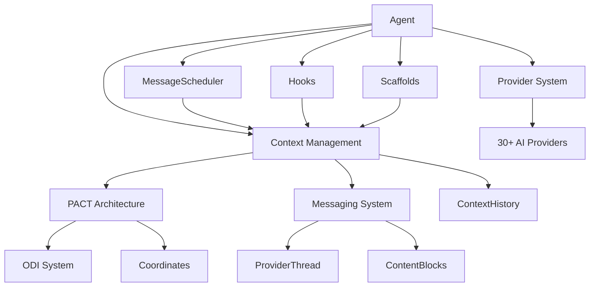

# Core Concepts Overview

Egregore is built around a few core architectural concepts that work together to provide a powerful, flexible framework for building AI agents. This page provides a high-level overview of these concepts and how they relate to each other.

## The Five Pillars

### 1. PACT Architecture

**Positioned Adaptive Context Tree** - The foundation of Egregore's context management system.

PACT treats context like a DOM (Document Object Model), allowing you to:
- **Position** components at precise coordinates like `(0,1,0)` or `(d2, 1, -3)`
- **Adapt** automatically as conversation history grows through ODI (Overlap Demotion Invariant)
- **Tree** structure enables infinite addressability and hierarchical organization

```python
# Insert a component at a specific position
context.pact_insert("d0, 1, 0", component)

# Components automatically adapt as history grows
# (0,1,0) → (1,1,0) → (2,1,0) as messages are added
```

<Card title="Learn More" icon="book" href="/core-concepts/pact-architecture">
  Deep dive into PACT architecture, coordinates, and the ODI system
</Card>

### 2. Context Management

The context system provides DOM-like manipulation of agent memory with four component lifecycle types:

- **Permanent** (`ttl=None`) - Never expire, most common for message content
- **Temporary** (`ttl=N`) - Expire after N turns, gone forever
- **Sticky** (`ttl=1, cadence=1`) - Follow their parent through ODI movements
- **Cyclic** (`ttl=N, cadence=M`) - Expire and reappear on a schedule

```python
# Create a temporary reminder that lasts 3 turns
reminder = TextContent(
    content="Remember to check user preferences",
    ttl=3
)
context.pact_insert("d0, 1, 0", reminder)
```

<Card title="Learn More" icon="database" href="/core-concepts/context-management">
  Explore context operations, component lifecycles, and TTL management
</Card>

### 3. Messaging System

Universal message handling with the **ProviderThread** container and **ContentBlocks**:

<CardGroup cols={2}>
  <Card title="3 Message Types" icon="message">
    - **SystemHeader**: System instructions and configuration
    - **ProviderResponse**: AI model responses
    - **ClientRequest**: User messages
  </Card>

  <Card title="Content Blocks" icon="cube">
    - **TextContent**: Plain text messages
    - **ToolCalls**: Function call requests
    - **Media types**: Image, Audio, Video, Document
  </Card>
</CardGroup>

```python
# Messages are automatically formatted for any provider
thread = agent.thread.current

# Access different message types
system_msg = thread.system_header
responses = thread.provider_responses
requests = thread.client_requests
```

<Card title="Learn More" icon="envelope" href="/core-concepts/messaging">
  Understand ProviderThread, ContentBlocks, and universal message handling
</Card>

### 4. Provider System

Unified interface for **30+ AI providers** with standardized methods:

```python
# Works identically across all providers
agent = Agent(provider="openai:gpt-4")
agent = Agent(provider="anthropic:claude-3-5-sonnet-20241022")
agent = Agent(provider="google:gemini-pro")

# All support the same interface
response = agent.call("Hello!")
async for chunk in agent.stream("Tell me a story"):
    print(chunk, end="")
```

**Features**:
- Universal token counting across all providers
- OAuth interceptors for premium models (GPT-5, Claude, etc.)
- 3-tier parameter merging (defaults < model_config < kwargs)

<Card title="Learn More" icon="plug" href="/core-concepts/providers">
  Explore the provider system and supported models
</Card>

### 5. Agent System

The orchestrator that ties everything together:

```python
from egregore import Agent

# Create an agent with automatic context management
agent = Agent(
    provider="openai:gpt-4",
    system_prompt="You are a helpful assistant"
)

# Context is automatically maintained across calls
agent.call("What's the weather?")
agent.call("What did I just ask you?")  # Agent remembers

# Access the underlying systems
agent.context      # Context tree
agent.hooks        # Hook system
agent.scaffolds    # Persistent memory
agent.history      # Snapshot access
```

<Card title="Learn More" icon="robot" href="/core-concepts/agents">
  Understand the Agent class and its capabilities
</Card>

## Advanced Systems

Beyond the five core pillars, Egregore provides advanced systems for sophisticated use cases:

### MessageScheduler

Core rendering and episode management system that:
- Advances context episodes (turns) automatically
- Processes TTL expirations and lifecycle transitions
- Manages the render lifecycle for dynamic components
- Coordinates ODI depth shifting

<Card title="Learn More" icon="clock" href="/core-concepts/message-scheduler">
  Deep dive into MessageScheduler and episode management
</Card>

### ContextHistory

Snapshot system for historical context access:
- Create snapshots at any point in conversation
- Access historical context states by episode number
- PACT-compliant serialization for persistence
- Query components using PACT selectors across snapshots

```python
# Create a snapshot
snapshot_id = agent.context.seal(trigger="before_tool_call")

# Access historical state
historical_context = agent.history.at_snapshot(snapshot_id)
component = historical_context["d0, 1, 0"]
```

<Card title="Learn More" icon="camera" href="/core-concepts/context-history">
  Explore ContextHistory and snapshot management
</Card>

## How It All Fits Together



### Typical Flow

1. **User sends message** → Agent receives via messaging system
2. **MessageScheduler** → Advances episode, processes TTL expirations
3. **Context updates** → Message added to PACT tree at `d0,0,0`
4. **ODI triggers** → Previous messages shift to `d1,0,0`, `d2,0,0`, etc.
5. **Hooks fire** → Observe or modify context changes
6. **Scaffolds render** → Update persistent memory based on changes
7. **Provider call** → Formatted message sent to AI model
8. **Response processed** → Added to context, cycle repeats

## What's Next?

<CardGroup cols={2}>
  <Card title="PACT Architecture" icon="sitemap" href="/core-concepts/pact-architecture">
    Learn about coordinates, positioning, and the ODI system
  </Card>

  <Card title="Context Management" icon="database" href="/core-concepts/context-management">
    Master context operations and component lifecycles
  </Card>

  <Card title="Agents" icon="robot" href="/core-concepts/agents">
    Understand the Agent class and its capabilities
  </Card>

  <Card title="Messaging" icon="envelope" href="/core-concepts/messaging">
    Explore ProviderThread and universal message handling
  </Card>
</CardGroup>
